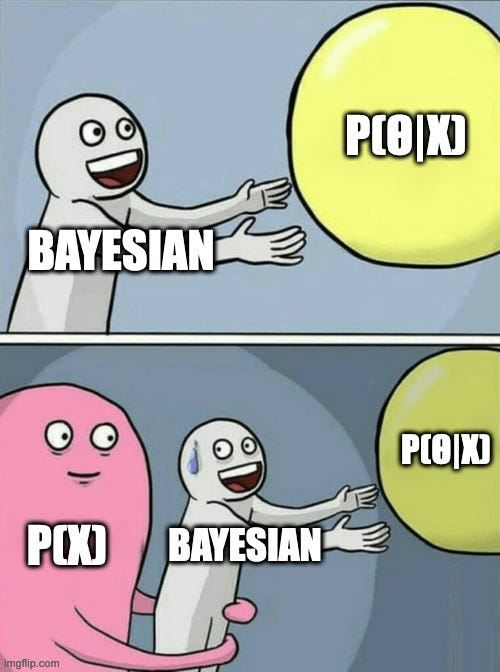

# Crash course on how to make your research Bayesian

A four-lecture crash course for physics BSc/MSc/PhD students. 

Each lecture is a Jupyter notebook with worked examples. `01-03_Bayes_course.pdf` contains
handwritten notes as supplementary material, and `syllabus.pdf` has the schedule.

Author: Oleg Komoltsev — [komoltsev.com](https://komoltsev.com)

## Setup

```bash
python3 -m venv .venv
source .venv/bin/activate
pip install -r requirements.txt
```

---

