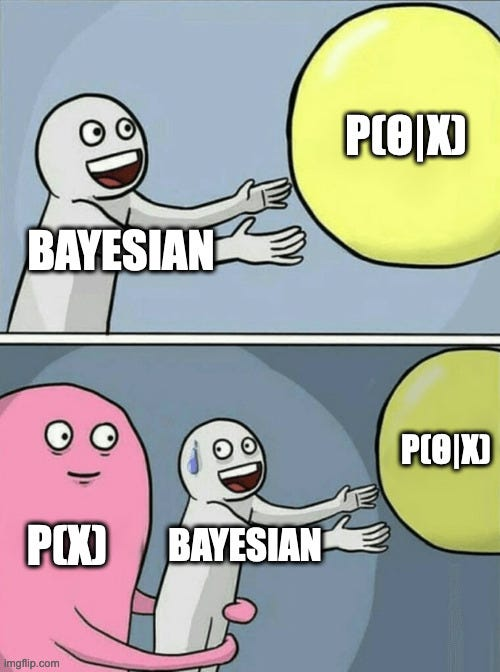

# Crash course: how to make your research Bayesian

A four-lecture crash course for physicists. Each lecture is a Jupyter notebook with worked examples. The handwritten notes in `handwritten_notes.pdf` supplement the notebooks, and `syllabus.pdf` has the schedule.

Author: Oleg Komoltsev — [komoltsev.com](https://komoltsev.com)

## Setup

```bash
python3 -m venv .venv
source .venv/bin/activate
pip install -r requirements.txt
```

---

